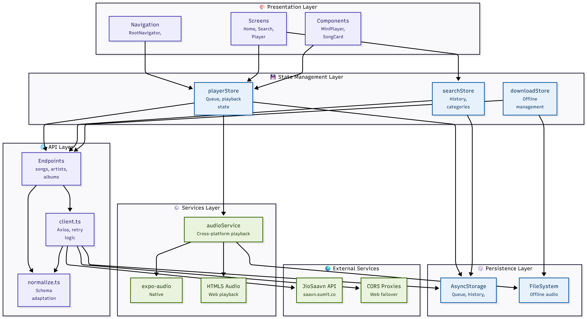

# Loko Music

A React Native (Expo) music app powered by the JioSaavn-compatible API at https://saavn.sumit.co.

This repository is focused on:
- Reliable music playback (native + web)
- Synchronized mini player and full player UI
- Queue management with local persistence
- Graceful fallback behavior when API calls fail

## Features

- Home screen with trending songs and pagination
- Search screen with history, categories, and paginated song results
- Full Player screen with seek, previous/next, shuffle, repeat, and download
- Persistent Mini Player synced with full player state
- Queue screen with add, reorder, remove, and persisted queue index
- Background playback support on mobile
- Offline song download support on native platforms

## API Contract

- Base URL: `https://saavn.sumit.co`
- API key: Not required
- Docs: `https://saavn.sumit.co/docs`

Supported endpoint families in this app:
- Search: `/api/search`, `/api/search/songs`, `/api/search/albums`, `/api/search/artists`, `/api/search/playlists`
- Songs: `/api/songs`, `/api/songs/{id}`, `/api/songs/{id}/suggestions`
- Artists: `/api/artists/{id}`, `/api/artists/{id}/songs`, `/api/artists/{id}/albums`
- Albums: `/api/albums?id=...` (with fallback support for `/api/albums/{id}`)
- Playlists: `/api/playlists/{id}` (with fallback support for `/api/playlists?id=...`)

The API layer is tolerant to both response shapes:
- `success: true`
- `status: "SUCCESS"`

Normalization also handles field variants like:
- `url` vs `link` for images and download URLs
- `primaryArtists` and `primaryArtistsId` CSV fields when nested artist objects are absent

## Tech Stack

- React Native (Expo) + TypeScript
- React Navigation (native stack + bottom tabs)
- Zustand for state management
- AsyncStorage for persistence
- expo-audio for native playback
- HTML5 Audio fallback on web
- expo-file-system for offline downloads

## Project Structure

```text
src/
  api/
    client.ts            # axios client, web CORS strategy, retry/failover
    normalize.ts         # payload normalizers and schema adaptation
    songs.ts             # songs endpoints
    artists.ts           # artists endpoints
    albums.ts            # album endpoints
    playlists.ts         # playlist endpoints
    search.ts            # search endpoints
    fallbackSongs.ts     # validated local fallback tracks
  components/
    MiniPlayer.tsx       # persistent mini player
    SongCard.tsx
    SeekBar.tsx
  navigation/
    RootNavigator.tsx    # app shell + always-mounted MiniPlayer
    TabNavigator.tsx     # Home/Search/Queue tabs
  screens/
    HomeScreen.tsx
    SearchScreen.tsx
    PlayerScreen.tsx
    QueueScreen.tsx
    ArtistScreen.tsx
    AlbumScreen.tsx
    PlaylistScreen.tsx
  services/
    audioService.ts      # cross-platform playback engine
  stores/
    playerStore.ts       # playback, queue, shuffle/repeat, persistence
    searchStore.ts
    downloadStore.ts
  utils/
    getImageUrl.ts
    storage.ts
```

## Setup

### 1. Prerequisites

- Node.js 20+
- npm 10+
- Expo CLI via `npx expo`
- For Android cloud builds: Expo account + EAS login

### 2. Install dependencies

```bash
npm install
```

### 3. Start development server

```bash
npx expo start
```

Useful variants:

```bash
npx expo start -c        # clear Metro cache
npx expo start --android
npx expo start --web
```

## Architecture



### Module Responsibilities

| Layer | Files | Responsibility |
|---|---|---|
| API | `src/api/client.ts`, `src/api/*.ts` | Request routing, retries, endpoint access |
| Normalization | `src/api/normalize.ts` | Converts `status/success`, `url/link`, artist CSV fields into stable app models |
| Playback | `src/services/audioService.ts` | Unified play/pause/seek/next/prev and stream candidate fallback |
| State | `src/stores/*.ts` | Single source of truth for playback, queue, downloads, search history |
| UI | `src/screens/*.tsx`, `src/components/*.tsx` | User interaction, list rendering, controls, synchronized mini/full player |
| Navigation | `src/navigation/*.tsx` | Route shell and persistent MiniPlayer mounting |
| Persistence | `src/utils/storage.ts`, `expo-file-system` | Queue/search persistence and offline file storage |

### Runtime Flow

1. A screen action (tap song, next, seek, add to queue) triggers a store or service method.
2. `audioService` resolves stream candidates (local file -> direct URL -> refreshed metadata/search fallback).
3. Player status updates (`position`, `duration`, `isPlaying`, `isBuffering`) are written into `playerStore`.
4. `MiniPlayer` and `PlayerScreen` render from the same store slices, so they remain synchronized.
5. Queue and index mutations persist immediately to AsyncStorage.
6. On app startup, stores rehydrate and restore queue/current track context.

### Failure Handling Strategy

- API shape variance: normalized via `normalize.ts`.
- Endpoint issues: `client.ts` retries and web proxy failover.
- Metadata gaps: playback refreshes song details before failing.
- Rate/network failures: Home/Search fall back to local/recent/fallback tracks.
- Stale fallback risk: fallback IDs are validated and include direct stream URLs.

## Screen Responsibilities

| Screen | Core responsibility |
|---|---|
| Home | Song feed + pagination + entry point to search |
| Search | Query input, history, category shortcuts, paginated results |
| Player | Full playback controls, seek, repeat/shuffle, download |
| Mini Player | Persistent playback bar synchronized with full player |
| Queue | Add/remove/reorder queue, persisted locally |

## Sync Model (Mini Player <-> Full Player)

Flow:
1. User taps a song on Home/Search/Artist/Album/Playlist.
2. `audioService.play(...)` updates `playerStore.playTrack(...)`.
3. `audioService` updates position/duration/isPlaying/isBuffering continuously.
4. Both `MiniPlayer` and `PlayerScreen` subscribe to the same store slices.
5. Queue mutations persist immediately (`persistQueue`) and are restored on app restart (`rehydrate`).

## Building the Application

### Android APK (internal distribution)

```bash
npx eas build --platform android --profile preview --non-interactive
```

### Android AAB (Play Store style)

```bash
npx eas build --platform android --profile production --non-interactive
```

Notes:
- Keep `scripts/ensure-expo-module-scripts-compat.cjs` in repo; EAS runs `postinstall` during cloud builds.
- The `preview` profile is configured to build APK in `eas.json`.

## Trade-offs

| Decision | Benefit | Cost / Trade-off |
|---|---|---|
| Zustand + AsyncStorage instead of Redux Toolkit + MMKV | Simpler implementation and less boilerplate | AsyncStorage is slower than MMKV for heavy data |
| Dual playback strategy (expo-audio native, HTML5 audio web) | Better playback reliability across platforms | More code paths to maintain |
| Aggressive API normalization | Tolerates payload variations (`success` vs `status`, `url` vs `link`) | Adds transformation complexity |
| Web CORS proxy failover | Better chance of working in restrictive web environments | External proxies can still be rate-limited/unreliable |
| Fallback song dataset | App remains usable during API outages | Fallback IDs/URLs can become stale and require periodic refresh |
| Queue persisted on every mutation | Strong sync consistency across app restarts | More frequent storage writes |

## Known Limitations

- Web downloads open media URL externally; true file download management is native-only.
- External CORS proxies may intermittently fail depending on region/network.
- Fallback content is curated and finite; not a complete catalog.

## Extra Features Included

- Shuffle and repeat modes
- Offline download support (native)
- API-failure fallback to local/recent/fallback song pools
- Queue reorder controls with index-safe persistence

## Quick Troubleshooting

- Music not loading:
  - Restart with cache clear: `npx expo start -c`
  - Verify internet and API reachability (`https://saavn.sumit.co`)
- Safe area crash:
  - Ensure app is wrapped with `SafeAreaProvider` (already done in `App.tsx`)
- EAS install dependency failure:
  - Ensure `scripts/ensure-expo-module-scripts-compat.cjs` exists before build
